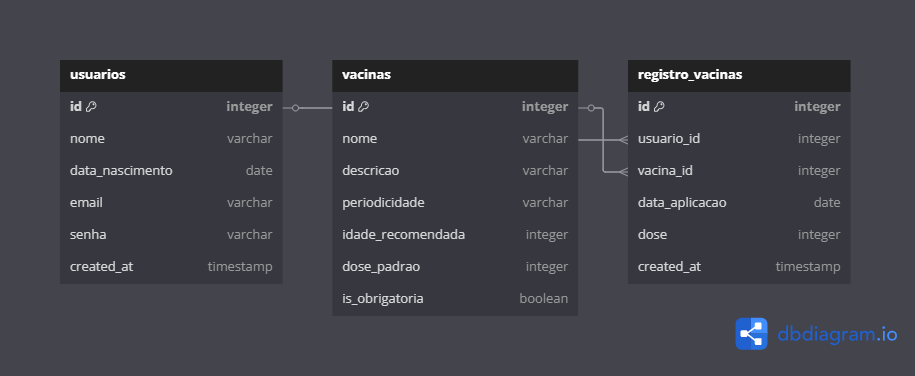
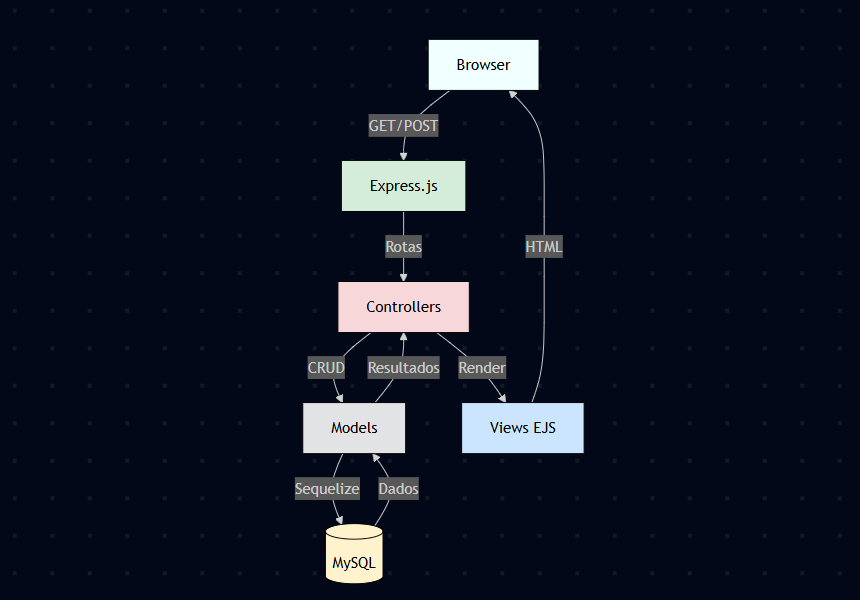

# Immuni - Sistema para Gerenciamento de Vacinas - CSI606 Sistemas Web I

# Documentação
O diretório contendo os protótipos se encontram em [assets](./assets/). A [proposta final](./assets/README.md) de elaboração do trabalho prático pode ser encontrada nesse mesmo diretório.

# Sobre o sistema
Este trabalho propõe o desenvolvimento de um sistema web que funcionará como um **Gerenciador de Vacinas**, visando auxiliar no controle e no registro de vacinas tomadas por usuários. O sistema permitirá o acompanhamento das vacinas recomendadas de acordo com a idade, bem como o cadastro de usuários e de vacinas. Seu principal objetivo é oferecer uma ferramenta prática e intuitiva para o gerenciamento do histórico de vacinação, promovendo maior organização e cuidado com a saúde.  

# 🛠️ Ferramentas Necessárias para o Funcionamento do Sistema:

[](https://developer.mozilla.org/en-US/docs/Web/JavaScript)

[](https://expressjs.com/)

[](https://www.mysql.com/)

[](https://sequelize.org/)

[](https://getbootstrap.com/)

[](https://nodejs.org/)

# 🧮 Modelo Lógico



# 🖥️ Estrutura do Projeto



O projeto Immuni foi desenvolvido utilizando uma arquitetura MVC (Model-View-Controller) com Node.js como ambiente de execução, Express.js como framework web e Sequelize como ORM (Object-Relational Mapping) para conexão com o banco de dados MySQL. Essa estrutura organiza o sistema em camadas bem definidas, cada uma com responsabilidades específicas, promovendo separação de conceitos e facilitando a manutenção do código.

# 🚀 Executando o Immuni

## ⚙️ Instalação das Dependências

Execute os seguintes comandos em sequência no terminal:

```bash
# Inicializa o projeto Node.js (caso não tenha feito ainda)
npm init -y

# Instala as dependências principais
npm install express mysql2 sequelize bcryptjs

# Instala dependências de sessão e autenticação
npm install cookie-parser cookie-session express-session connect-flash express-flash session-file-store

# Instala o nodemon para desenvolvimento
npm install --save-dev nodemon

# Instala o express-handlebars (template engine)
npm install express-handlebars

# Cria a estrutura básica de pastas (opcional)
mkdir -p models/ controllers/ views/ routes/ config/ public/

# Executando

npm start